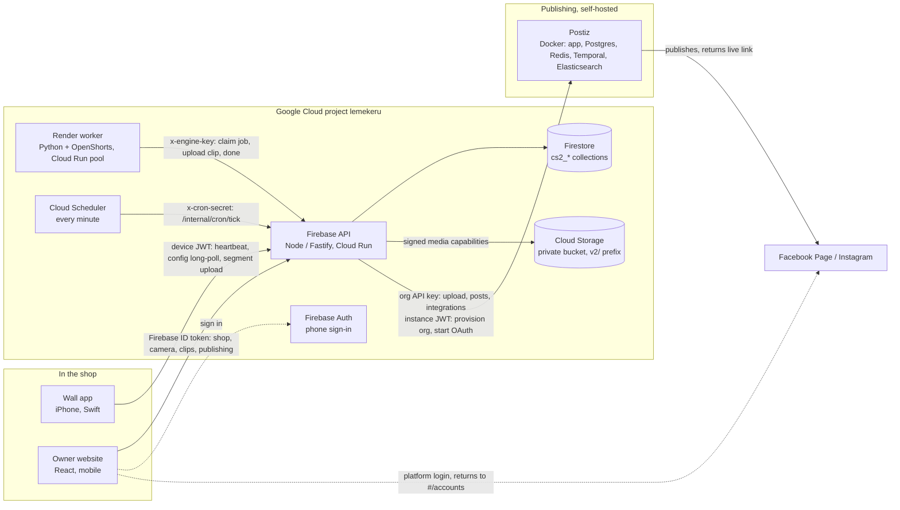

# Architecture and code map

ContentStation is four runtime pieces and one shared contract. A mounted iPhone films the shop, a Node API on Cloud Run owns all data access, a Python worker renders vertical clips with OpenShorts, and a mobile website lets the owner review, share and publish. Publishing goes through a self-hosted Postiz instance, one organization per shop.

## Repository map

| Path | What lives there | Read first |
| --- | --- | --- |
| `HANDOFF-PLAN.md` | Deployed state, verification evidence, direction, remaining work | always |
| `product.json` | Product name, URLs, timing constants; `scripts/sync-product.sh` copies it into the apps | when copy or timing changes |
| `firebase-api/` | The API (below) | backend work |
| `owner-app/` | Owner website (below) | UI work |
| `wall-app/` | Native iOS camera app: `Sources/App` (coordinator, state machine), `Capture` (motion-gated recording, segment writer), `Network` (API client, upload queue), `Pairing` (QR), `Tests/run.sh` | camera work |
| `engine-worker/` | `contentstation_worker.py` claims jobs, downloads the segment, selects a window, runs pinned OpenShorts, uploads clip and thumbnail; `tests/` | render work |
| `postiz/` | Pinned Postiz Compose stack, env examples, README with routes and limits | publishing service |
| `deploy/` | Cloud Build and Cloud Run env files for the API image and the worker image | deploying |
| `scripts/` | `local.mjs` (emulators + API + owner + worker), `postiz-local.mjs` (Postiz stack + isolation check), `smoke-e2e.py` (local real render), `smoke-hosted.mjs` (hosted upload → render), `sync-product.sh`, `setup-openshorts.sh`, `install-wall-device.sh` | running things |
| `docs/` | Contract, hosted setup, architecture, reports, design handoff, archive; index in `docs/README.md` | reference |
| `firebase.json`, `firebase.hosted.json`, `*.rules`, `firestore.indexes.json` | Emulator config, hosted deploy targets, deny-all client rules | deploying |

## Firebase API (`firebase-api/src`)

One process, one Fastify instance, composed in `app.ts`:

| File | Responsibility |
| --- | --- |
| `app.ts` | `buildApp(options)`: creates the context, registers every route module, returns the app. Tests call this directly with injected clocks, secrets and a fake Postiz. |
| `server.ts` | Listens on `PORT`/`HOST`; that is all. |
| `context.ts` | `createContext(options)`: Fastify instance (HTTP/2 when `API_HTTP2=true`), CORS, error envelope, Firebase Admin clients, secrets, and the shared helpers every route uses: `owner`/`ownerShop` (Firebase ID token → shop through `cs2_memberships`), `device` (device JWT), `engine` (worker key), `ownedClip`, `currentDevice`, `capability`/`readUrl` (signed, expiring media URLs), `config`/`cameraStatus`/`presentClip` (response shapes), `requireLease`, `revokeSource`/`cleanupDeletion` (deletion tombstones). Exports `Ctx`. |
| `lib/errors.ts` | `ApiError` and `fail(status, code, message)`. |
| `lib/validate.ts` | `str`, `finite`, `timestamp`, `validateHours`, `hash`, constant-time `equal`. |
| `lib/time.ts` | Shop-local dates, `DEFAULT_HOURS`, next opening time. |
| `lib/paths.ts` | Deterministic clip/thumbnail object paths per job and index. |
| `lib/product.ts`, `lib/types.ts` | Root `product.json` loader; `Row` and request types. |
| `postiz.ts` | `PostizClient` (enterprise provisioning, connect URL, integrations, streaming upload, posts) and `KeyVault` (AES-GCM for per-shop organization keys). |
| `routes/owner.ts` | `/health`, `/me`, `/shops`, `/shops/current`, `/shop/hours/suggest`, the 410 for the old OTP routes. |
| `routes/pairing.ts` | `/pair/token`, `/pair/status`, `/pair/reading`, `/pair/claim`: single-use codes, atomic claim, device replacement. |
| `routes/camera.ts` | Owner-side camera controls: status, pause/resume, framing, preview, saved reference frame, unpair. |
| `routes/device.ts` | Camera-side: `/device/config` long-poll, heartbeat, status, segment upload grant and completion (creates the render job), preview/thumb images. |
| `routes/clips.ts` | `/clips` by day, clip detail, caption, open/share/skip/report events, deletion (also cancels queued posts). |
| `routes/publishing.ts` | Connected accounts, connect/reconnect/remove, publish/schedule, publication status, cancel, completion webhook, and the reconciliation used by clip deletion and the maintenance tick. |
| `routes/engine.ts` | Worker queue: claim with 120 s leases, heartbeat, output upload grants, idempotent completion, failure with three attempts. |
| `routes/media.ts` | `PUT`/`GET /media/:token`: capability verification, immutable streaming uploads, HTTP range reads. |
| `routes/maintenance.ts` | `/internal/cron/tick` (retention, expired leases, daily SMS, pair-token expiry, publication reconciliation) and the signed Twilio inbound webhook. |

Firestore collections (all prefixed `cs2_`): `shops`, `memberships`, `devices`, `pair_tokens`, `uploads`, `segments`, `engine_jobs`, `clips`, `clip_events`, `notifications`, `publishing_orgs`, `publications`. Storage objects live under `v2/segments/…`, `v2/clips/…`, `v2/thumbs/…`.

Tests (`firebase-api/test`): `api.test.ts` (flows against the emulators), `retention.test.ts`, `http2.test.ts`, `routes.test.ts`, `publishing.test.ts` with `fake-postiz.ts`.

## Owner website (`owner-app/src`)

| Area | Files |
| --- | --- |
| Entry and shell | `main.tsx`, `App.tsx` (session gate, onboarding redirect, bottom navigation), `router.ts` (hash routes), `styles.css` |
| API layer | `api/Api.ts` (interface), `api/firebase.ts` (real adapter: ID tokens, retry on 401), `api/firebaseAuth.ts` (phone sign-in with reCAPTCHA), `api/mock.ts` (explicit demo data, `VITE_DEMO_MODE=true` only), `api/config.ts`, `api/types.ts` |
| Screens | `screens/SignIn`, `Code`; onboarding `Shop`, `Wifi`, `Qr`, `Frame`, `Hours`, `Done`; `Home`, `ClipDetail`, `Camera`, `Rescan`, `Replace`, `Settings`, `Accounts` |
| Publishing UI | `components/PublishPanel.tsx` (review sheet, outcome list), `hooks/usePublications.ts`, `lib/publishing.ts` (labels, shop-time conversion), `screens/Accounts.tsx` |
| Shared UI | `components/Button`, `Sheet`, `Input`, `ClipCard`, `StripedPanel`, `StatusDot`, `BottomNav`, `QRCode`, `Toast` |
| Helpers | `lib/format.ts` (dates in the shop timezone, phone formatting, hours summaries), `lib/status.ts` (camera status mapping), `lib/share.ts` (native share / download), `lib/style.ts` (prototype style strings), `lib/state.ts`, `lib/wifi.ts`, `lib/navigation.ts` |
| Hooks | `hooks/useSession`, `usePolling`, `useToast`, `useClipShare` |

Tests sit next to the code as `*.test.ts(x)` and run with `npm --prefix owner-app test` (vitest, jsdom).

## Where a request travels

1. **Recording** — the wall app records motion-gated segments, asks `POST /device/segment/upload-url`, `PUT`s the MP4 to the signed URL, calls `/device/segment/complete`; the API verifies the stored object and creates one `cs2_engine_jobs` document.
2. **Rendering** — the worker claims the job, downloads through a signed read URL, renders with OpenShorts, uploads clip and thumbnail through job-bound upload URLs, calls `/engine/jobs/:id/done`; the API creates `cs2_clips`.
3. **Reviewing** — the owner website lists `/clips`, plays through `GET /media/:token` with range requests, edits the caption, shares or downloads.
4. **Publishing** — the owner connects an account (API → Postiz `/enterprise/url` → platform login → back to `#/accounts`), then publishes: the API uploads the clip to the shop's Postiz organization, creates one post per account, and polls `GET /public/v1/posts` until each is published, failed or cancelled.
