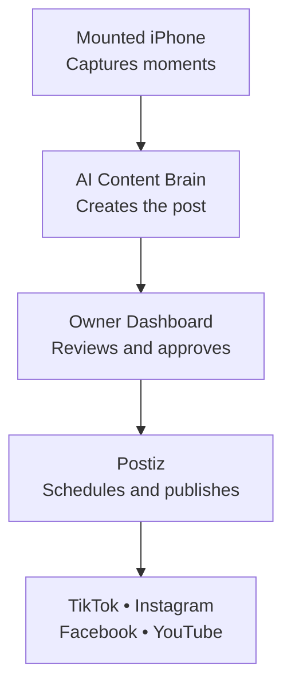
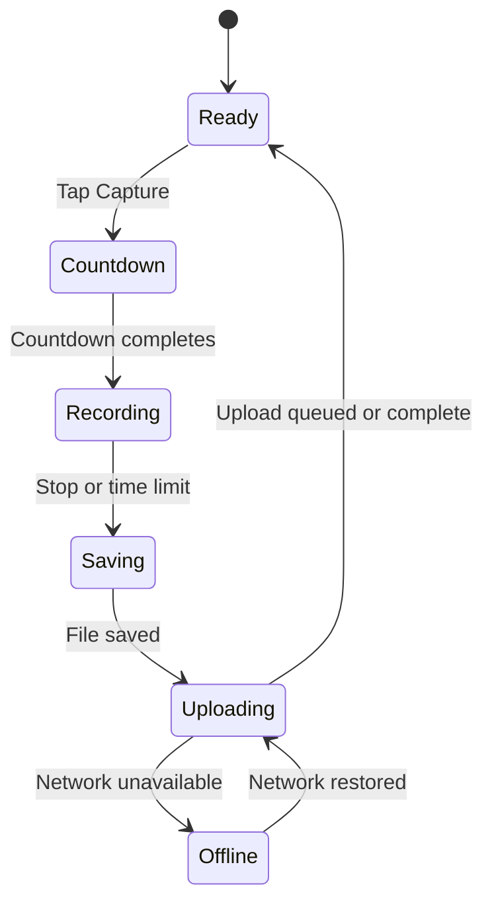
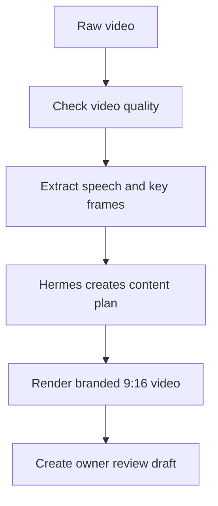
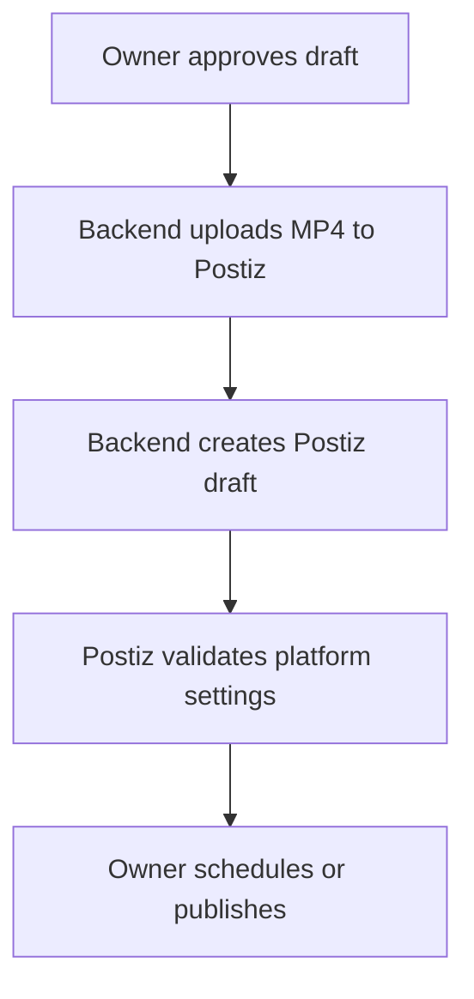
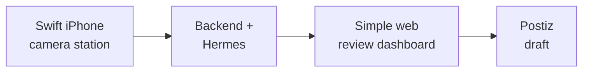

# Content Station — App Structure

## Simple Product Overview

Content Station is one product made of four connected parts:



In simple terms:

- The mounted iPhone captures the moment.
- The backend uploads and processes the video.
- Hermes decides how to turn it into content.
- The owner reviews and approves it.
- Postiz schedules or publishes it.

The mounted iPhone should be built with SwiftUI and AVFoundation. The owner dashboard should initially be a responsive Next.js website. The backend can use TypeScript, Fastify, PostgreSQL/Supabase, Redis, FFmpeg, Hermes Agent, and Postiz.

---

## 1. Mounted iPhone Station

The mounted iPhone is a dedicated camera station inside the business. It is plugged into power, positioned at one fixed angle, and kept on the Content Station screen.

Its main job is to capture reliable footage. Staff should not manage captions, social accounts, schedules, or analytics from this device.

### Main Station Screen

```text
┌─────────────────────────┐
│       CONTENT STATION   │
│                         │
│     LIVE CAMERA VIEW    │
│                         │
│     ┌─────────────┐     │
│     │ Capture Zone│     │
│     └─────────────┘     │
│                         │
│       ● READY           │
│                         │
│   [ CAPTURE MOMENT ]    │
│                         │
│  Wi-Fi ✓   Uploads: 0   │
└─────────────────────────┘
```

### Main Station Actions

1. A person steps into the marked capture area.
2. A staff member taps **Capture Moment**.
3. The app counts down: 3, 2, 1.
4. The app records for 15 or 30 seconds.
5. The screen clearly displays **RECORDING** and a Stop button.
6. The app saves the video locally.
7. The app uploads the video automatically when Wi-Fi is available.
8. The app returns to the Ready screen.

### Additional Station Screens

#### Welcome and Pairing

- Shows the Content Station logo.
- Lets the business owner pair this iPhone using a temporary pairing code.
- Connects the station to the correct business workspace.

#### Camera and Microphone Permission

- Explains why camera access is needed.
- Explains why microphone access is needed.
- Provides an Open Settings button when permission is denied.

#### Station Setup

- Shows the live rear-camera preview.
- Helps the owner position the phone.
- Displays a 9:16 capture-zone guide.
- Lets the owner choose 15- or 30-second recording.
- Lets the owner select 720p or 1080p.
- Includes a test recording.

#### Capture Preview

- Shows the most recent recording.
- Allows immediate deletion.
- Shows whether the file is saved, uploading, or uploaded.
- Automatically returns to the station screen after a short delay.

#### Upload Queue

- Lists pending uploads.
- Shows progress and errors.
- Includes Retry.
- Confirms when it is safe to remove the local file.

#### Station Health

- Wi-Fi connection
- Available storage
- App version
- Last successful upload
- Pending upload count
- Camera and microphone status
- Device temperature warning when available

#### Locked Settings

- Requires the owner's PIN or authentication.
- Change recording duration.
- Change video quality.
- Reposition or test the camera.
- Revoke station access.
- Delete local confirmed files.

### Station States



### Important Station Rules

- The camera preview must remain visible whenever capture is available.
- Recording must never be hidden.
- The station must show a clear red recording indicator and timer.
- The app must stop recording if interrupted or moved to the background.
- A completed recording must be saved locally before upload starts.
- The local file must remain until the server verifies the upload.
- The app must restore pending uploads after relaunch.
- The first version does not continuously record or use motion detection.

---

## 2. AI Content Brain

The AI Content Brain runs on the server after the mounted iPhone uploads a video.



### Video Processing

The server:

- Checks video duration, orientation, dimensions, audio, and file integrity.
- Creates thumbnails.
- Extracts speech into a transcript when speech exists.
- Detects general quality concerns such as poor lighting or blurry footage.
- Normalizes the video to a 9:16 MP4.
- Sends structured information to Hermes.

### Hermes Responsibilities

Hermes acts as the content director. It receives:

- Business name and category
- Target audience
- Brand voice
- Current offers
- Default call to action
- Prohibited claims
- Video transcript
- Description of the scene
- Quality warnings
- Available editing templates

Hermes returns:

- Whether the footage is useful
- Content angle
- Three hook options
- Selected hook
- On-screen title
- Instagram caption
- TikTok caption
- Facebook caption
- Call to action
- Hashtags
- Recommended platforms
- Recommended posting time
- Editing instructions
- Privacy, quality, or copyright warnings

Hermes should make content decisions. It should not receive infrastructure credentials, manipulate raw binary video, run FFmpeg commands, access the database directly, or publish content without approval.

### Video Rendering

The server uses deterministic video-processing code to:

- Trim the clip
- Convert it to 1080 × 1920
- Add the selected hook
- Add subtitles when appropriate
- Add the business logo
- Add a short end-card CTA
- Export an H.264 MP4 with AAC audio

The first version has three templates:

1. **Today at the Business**
2. **Behind the Scenes**
3. **Before and After**

The system uses original camera sound by default. It does not automatically add copyrighted or trending music.

---

## 3. Owner Dashboard

The owner dashboard should initially be a responsive website that works on a phone, tablet, or computer. The mounted iPhone does not need to provide the complete owner experience.

### Dashboard Home

```text
┌─────────────────────────────────┐
│ Content Station                 │
│                                 │
│ Today                           │
│  4 captured   3 ready   1 posted│
│                                 │
│ Drafts needing review           │
│                                 │
│ ┌─────────┐  Today's Leg Day    │
│ │ Video   │  Gym Community      │
│ │Preview  │  [Review Draft]     │
│ └─────────┘                     │
│                                 │
│ ┌─────────┐  New Member Story   │
│ │ Video   │  Testimonial        │
│ │Preview  │  [Review Draft]     │
│ └─────────┘                     │
└─────────────────────────────────┘
```

The dashboard shows:

- Captures today
- Drafts processing
- Drafts needing review
- Approved drafts
- Published or scheduled posts
- Station connection and health
- Recent errors requiring attention

### Draft Review Screen

```text
┌─────────────────────────────┐
│       VIDEO PREVIEW         │
│                             │
│  Hook                       │
│  [Leg day is better when...]│
│                             │
│  Caption                    │
│  [Editable caption text...] │
│                             │
│  Platforms                  │
│  ☑ Instagram  ☑ TikTok     │
│  ☑ Facebook                 │
│                             │
│ [Reject] [Edit] [Approve]   │
└─────────────────────────────┘
```

The owner can:

- Watch the generated video.
- Choose between three hooks.
- Edit the caption.
- Edit the CTA and hashtags.
- Select social platforms.
- Review privacy, copyright, and quality warnings.
- Regenerate the copy.
- Reject and delete the draft.
- Approve the content for Postiz.

### Brand Profile

The owner configures:

- Business name
- Business category
- Location and timezone
- Target audience
- Brand tone
- Logo
- Primary color
- Offers and services
- Default CTA
- Social handles
- Language
- Claims or phrases AI must not use

### Station Management

The owner can:

- See whether the station is online.
- View last activity.
- Check app version and pending uploads.
- Change recording duration and video quality.
- Revoke a station.
- Pair a replacement iPhone.

### Publishing Settings

The owner can:

- Connect or configure Postiz.
- View available social integrations.
- Choose default platforms.
- Choose whether approved content becomes a Postiz draft or scheduled post.
- Configure preferred posting windows later.

The MVP should create Postiz drafts rather than immediately publishing publicly.

### Privacy and Data Settings

The owner can:

- Review the capture policy.
- Download or print the capture-zone notice.
- Choose raw-video retention between 1 and 30 days.
- Delete individual captures.
- Delete all workspace data.
- Review a simple history of approvals, deletions, and publishing actions.

---

## 4. Postiz Publishing Layer

Postiz handles the social-network side of the product.

### Postiz Responsibilities

- Connect social accounts.
- Receive the final MP4.
- Receive platform-specific captions.
- Create drafts.
- Schedule posts.
- Publish posts where supported and authorized.
- Manage the content calendar.
- Later provide performance information.

### Approval Flow



The Postiz API key and social tokens must never be stored inside the mounted iPhone application. Only the backend communicates with Postiz.

---

## 5. Complete Everyday Example

For a gym, the complete experience could work like this:

1. A member is about to attempt a personal record.
2. The member steps into the designated Content Station area.
3. A trainer taps **Capture Moment**.
4. The iPhone counts down and records the lift.
5. The video uploads automatically.
6. The server extracts the key frames and original audio.
7. Hermes generates: **The whole gym stopped to watch this PR.**
8. The video renderer adds the gym logo, title, and subtitles.
9. The owner receives: **A new post is ready.**
10. The owner watches the video and changes one sentence.
11. The owner taps **Approve to Postiz**.
12. Postiz creates drafts for Instagram, TikTok, and Facebook.
13. The owner schedules or publishes them.

---

## 6. Recommended Technology Structure

| Product area | Recommended technology |
| --- | --- |
| Mounted iPhone station | SwiftUI + AVFoundation |
| Local station persistence | SwiftData or SQLite |
| Reliable uploads | Background URLSession |
| Owner dashboard | Next.js + TypeScript |
| Backend API | TypeScript + Fastify |
| Authentication | Supabase Auth |
| Database | PostgreSQL/Supabase |
| Private media storage | S3-compatible storage or Supabase Storage |
| Job queue | Redis + BullMQ |
| Video processing | FFmpeg worker |
| Content intelligence | Hermes Agent |
| Social publishing | Postiz Public API |
| Notifications | APNs / Expo Push Service for web-connected owner flow |

### Why Native Swift for the Station

The camera is the foundation of the product. Native Swift provides stronger control over:

- Camera configuration
- Recording interruptions
- Focus and exposure
- Stabilization
- Video resolution and frame rate
- Thermal and storage conditions
- Reliable background uploads
- Long-running mounted use
- Bluetooth accessories
- Future servo integration

The owner dashboard is a conventional business application, so Next.js is faster and easier to iterate than building a second native app immediately.

---

## 7. First Version We Are Building



### Phase 1: Camera Proof

- Rear-camera preview
- Three-second countdown
- 15-second recording
- Clear recording indicator
- Reliable local storage
- Upload to backend

### Phase 2: AI Draft

- Video inspection
- Thumbnail extraction
- Transcription
- Hermes content plan
- One branded 9:16 video template
- Draft-ready notification

### Phase 3: Review and Publishing

- Owner dashboard
- Video preview
- Caption and hook editing
- Approve or reject
- Postiz media upload
- Postiz draft creation

### Phase 4: Pilot Hardening

- Offline upload recovery
- Storage and retention management
- Station health monitoring
- Duplicate-publishing prevention
- Privacy and deletion controls
- Seven-day real-business pilot

---

## 8. What We Are Not Building Yet

- Continuous all-day recording
- Background camera recording
- Motion detection
- Face recognition
- Customer identification or analytics
- Automatic public posting without approval
- A CapCut-style video editor
- Multi-location administration
- Android support
- Servo or motorized movement
- Automatic trending music

These features can be considered after the fixed-angle workflow proves that businesses consistently approve and publish the generated content.

---

## 9. Product Summary

Content Station should remain simple:

> The mounted iPhone captures. Hermes thinks. The owner decides. Postiz distributes.

The first product is not one enormous mobile application. It is four focused systems working together:

1. A reliable Swift camera station
2. A cloud content-processing system
3. A simple owner review dashboard
4. A Postiz publishing connection

The first success milestone is one mounted iPhone producing one piece of content that a real business owner is genuinely willing to publish.

